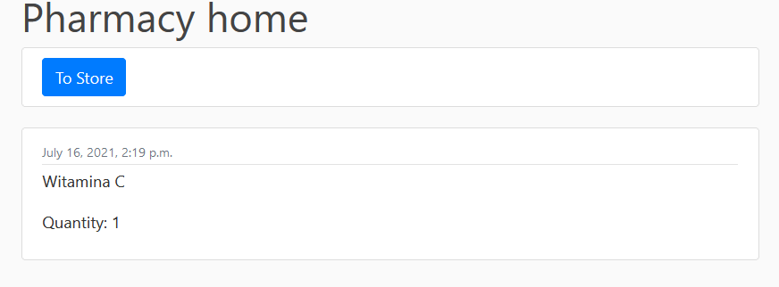

# Clinic-Project
Projekt na zaliczenie przedmiotu.

### Instalacja:
        1. Create any virtual enviroment.
        2. `pip install -r requirements.txt`
        3. Delete every file except `__init__.py` in directories account.migrations,\
           main_app.migrations, pharmacy.migrations, 
        4. Delete db.sqlte3 
        5. python manage.py makemigrations
        6. python manage.py migrate
        7. python manage.py runserver

### Funkcjonalności:
Changed default Account model in order to use Email instead of login for authorization.
            

#### Home Page:
    Possibility to add Articles to home page through admin page.

#### Profile Page:
    Profile info
    Information about incoming appointement.

#### Personal Note:
    - Adding
    - Update
    - Delete

    

### Pharmacy 
    Admin have access to create prescriptions for clients.
    Admin have access to add druges to store.
    People in pharmacy has list of prescriptions to buy. 
    In store people can add drugs to cart.

    

### Cart
    Possibility to modify cart.

    Possibility to see cart page.

### Drug Managing.
    Add prescription

    Prescription List

    
        

    
            
    
